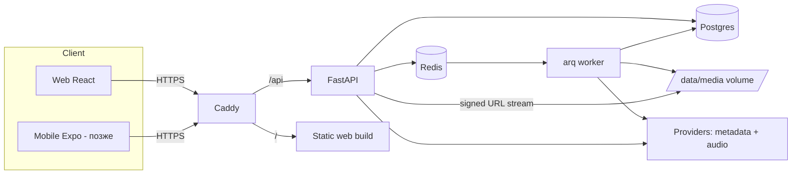

# Moozzzer — Roadmap

Легенда исполнителей:
- **[OPUS]** — сложные/архитектурные задачи, безопасность, ревью. Дорогие токены → давать чёткий scope.
- **[QWEN]** — локальные модели. Небольшие задачи по готовому образцу/контракту, UI-компоненты, тесты, рутина.
  - По умолчанию — **Qwen3-Coder-Next** (агентный режим, несколько файлов, прогон тестов).
  - **Qwen2.5-Coder-14B** — быстрые задачи в одном файле (компонент, стили, i18n, мелкий фикс) и автодополнение в редакторе.
- **[ВЫ]** — ручные действия (сервер, секреты, аккаунты).

Принцип: **Opus задаёт контракт и образец → Qwen размножает по образцу → Opus делает ревью ключевых PR.**

---

## 1. Архитектура



### Ключевые решения
| Вопрос | Решение | Почему |
|---|---|---|
| Язык API | Python/FastAPI | yt-dlp, ytmusicapi, ML-библиотеки — всё на Python |
| БД | Postgres | 12 GB RAM хватает с запасом; JSONB, полнотекст, pgvector для «Моей волны» v2 |
| Очередь | arq + Redis | легче Celery, async, хватает для семьи |
| Web | React + Vite | общий код/типы с React Native для мобилок |
| Стриминг файлов | Подписанные короткоживущие URL (`/media/{id}?exp=&sig=`) + поддержка HTTP Range | `<audio>` и track-player не умеют слать Bearer-заголовок удобно; один механизм для web и mobile |
| Авторизация | JWT access (15 мин) + refresh (30 дней, ротация, хранится хэш в БД). Web — httpOnly cookie, mobile — Bearer | один бэкенд для всех клиентов |
| Регистрация | Только по инвайт-коду, первый пользователь — admin | сервис семейный, не публичный |
| Формат хранения | MP3 (настраиваемо: `AUDIO_FORMAT=mp3|m4a|opus`, `AUDIO_BITRATE=256k`) | MP3 — максимальная совместимость; m4a/opus — без потери качества при перекодировании |
| Деплой | GH Actions → образы в GHCR (arm64) → SSH на сервер → `docker compose pull && up -d` | сервер не тратит CPU на сборку |

### Провайдеры (плагинная модель)
Два типа провайдеров в `backend/app/providers/`:
- **MetadataProvider** — ищет треки и отдаёт метаданные (название, артист, альбом, длительность, обложка, ISRC, explicit).
  Кандидаты: Spotify Web API, Deezer API, iTunes Search API, Яндекс Музыка (неофиц.), MusicBrainz.
- **AudioProvider** — по метаданным находит и отдаёт аудиопоток. Кандидаты: YouTube Music (ytmusicapi + yt-dlp), SoundCloud (yt-dlp).

Поиск: параллельный запрос ко всем включённым провайдерам → нормализация → дедупликация (по ISRC, иначе `artist+title+duration±3s`) → ранжирование.
При воспроизведении/сохранении — `AudioProvider` подбирает лучший источник (приоритет: оригинал/explicit-версия, совпадение длительности).

> ⚠️ Юридически: скачивание с площадок нарушает их ToS, а сервисы с DRM (Spotify, Яндекс) аудио не отдают — их используем **только для метаданных**. Для личного/семейного использования без публичного доступа риск минимален, но сервис не должен быть открыт наружу (только инвайты).

### Схема БД (черновик — утверждается в задаче 1.1)
```
users(id uuid pk, email unique, username, password_hash null, google_sub unique null, role, created_at)
invites(code pk, created_by fk, used_by fk null, expires_at)
refresh_tokens(id, user_id fk, token_hash, expires_at, revoked_at, user_agent)
tracks(id uuid pk, title, artist, album, duration_ms, isrc null, explicit bool,
       source_provider, source_id, file_path null, file_size, codec, bitrate,
       cover_path null, status enum[pending,downloading,ready,failed], error null,
       orphaned_at null, created_at)   unique(source_provider, source_id)
user_library(user_id, track_id, added_at)  pk(user_id, track_id)
playlists(id, user_id, name, description, cover_path, created_at, updated_at)
playlist_tracks(playlist_id, track_id, position numeric, added_at)
listen_events(id, user_id, track_id null, provider_ref null, started_at, played_ms, completed, skipped, context enum[search,library,playlist,wave])
```
**Жизненный цикл файла:** трек «используется», пока есть строка в `user_library` или `playlist_tracks`.
Когда последняя ссылка удалена → `orphaned_at = now()`. Ночной job удаляет файлы с `orphaned_at < now() - 7 days`
(grace-период — если случайно удалил, можно вернуть без повторной загрузки).

---

## 2. Этапы

Каждый этап заканчивается **рабочей версией на сервере**. Не начинать следующий, пока текущий не задеплоен.

### Этап 0 — Фундамент и CI/CD
Цель: «Hello world» на HTTPS-домене, автодеплой из `main`.

| # | Задача | Кто |
|---|---|---|
| 0.1 | Сервер: Docker, пользователь `deploy`, SSH-ключ, открыть 80/443 в Oracle Security List **и** в iptables (у Oracle Ubuntu есть свои правила!), DNS: `A moozzzer.ekroll.app → IP сервера` в Cloudflare (DNS only) | ВЫ |
| 0.2 | Скелет монорепо: `backend/` (FastAPI + `/api/health`), `apps/web/` (Vite+React+TS+Tailwind), Dockerfiles (multi-stage, arm64), `docker-compose.yml` (dev) и `deploy/docker-compose.prod.yml`, Caddyfile, `.env.example`, `Makefile` | OPUS |
| 0.3 | GitHub Actions: `ci.yml` (lint+test на PR), `deploy.yml` (build arm64 → GHCR → SSH deploy → alembic upgrade → healthcheck) | OPUS |
| 0.4 | Секреты в GitHub (`SSH_HOST`, `SSH_KEY`, `.env` прод), branch protection на `main` | ВЫ |
| 0.5 | Pre-commit хуки, ruff/eslint/prettier конфиги, шаблон PR | QWEN |

✅ Готово, когда: push в `main` → через несколько минут новая версия на `https://moozzzer.ekroll.app`.

### Этап 1 — Пользователи и авторизация
| # | Задача | Кто |
|---|---|---|
| 1.1 | Модели БД **всего проекта** (схема выше) + первая миграция. Утвердить контракт | OPUS |
| 1.2 | Auth: register по инвайту, login, refresh-ротация, logout, `/me`, argon2, rate-limit на login, CLI `create-admin` | OPUS |
| 1.3 | Эндпоинты инвайтов для admin (создать/список/отозвать) — по образцу 1.2 | QWEN |
| 1.4 | Генерация `packages/api-client` из OpenAPI (скрипт + CI-проверка, что клиент актуален) | QWEN |
| 1.5 | Web: страницы Login/Register, защищённые роуты, auth-store, авто-refresh | QWEN |
| 1.6 | Google OAuth (Authorization Code + PKCE), привязка к существующему аккаунту по email | OPUS (можно отложить) |

### Этап 2 — Дизайн-система и оболочка приложения
| # | Задача | Кто |
|---|---|---|
| 2.1 | Дизайн-токены (цвета, типографика, радиусы, тени, motion-пресеты), тёмная тема, шрифт Inter/Geist, иконки lucide | OPUS |
| 2.2 | Layout: сайдбар слева (Моя волна, Поиск, Медиатека, Плейлисты), центральная область, нижняя панель плеера (пока UI-заглушка) | QWEN |
| 2.3 | Анимированный фон в центре: mesh-gradient / WebGL-шейдер, цвет подстраивается под обложку текущего трека (fast-average-color), `prefers-reduced-motion` | OPUS |
| 2.4 | Компоненты: TrackRow, TrackCard, PlaylistCard, Skeleton, EmptyState, Toast — по токенам 2.1 | QWEN |
| 2.5 | Адаптив (мобильный браузер: сайдбар → нижняя навигация) | QWEN |

Ориентир стиля: тёмный минимализм, стекло (backdrop-blur) на панелях, крупные обложки, плавные spring-анимации Framer Motion, shared-layout переход «мини-плеер → полноэкранный плеер».

### Этап 3 — Ядро плеера и медиатека (без внешних площадок)
Цель: плеер работает на локальных файлах — проверяем всю цепочку до подключения поиска.
| # | Задача | Кто |
|---|---|---|
| 3.1 | Хранилище: `/data/media/{aa}/{uuid}.{ext}`, подписанные URL, стриминг с Range, обложки | OPUS |
| 3.2 | Admin-эндпоинт ручной загрузки файла (для тестов и своих mp3), чтение тегов mutagen | QWEN |
| 3.3 | Плеер (Web): очередь, play/pause/next/prev, seek, громкость, shuffle/repeat, прогресс, **Media Session API** (управление с экрана блокировки/наушников) | OPUS |
| 3.4 | Медиатека: список, удаление, лайк; эндпоинты `/library` | QWEN |
| 3.5 | Плейлисты: CRUD, добавление/удаление, drag-n-drop сортировка (dnd-kit) | QWEN |
| 3.6 | Логика orphan + ночной GC-job | OPUS |

### Этап 4 — Поиск по площадкам и предпрослушивание
| # | Задача | Кто |
|---|---|---|
| 4.1 | `providers/base.py`: интерфейсы `MetadataProvider`, `AudioProvider`, модели `TrackCandidate`, `AudioSource`; реестр, таймауты, кэш в Redis; **эталонный провайдер** (YouTube Music) | OPUS |
| 4.2 | Агрегатор поиска: параллельно, нормализация, дедуп, ранжирование, `GET /search?q=` | OPUS |
| 4.3 | Провайдер Deezer (metadata) — по образцу 4.1 | QWEN |
| 4.4 | Провайдер iTunes (metadata) — по образцу | QWEN |
| 4.5 | Провайдер Spotify (metadata, client credentials) — по образцу | QWEN |
| 4.6 | Провайдер SoundCloud (audio) — по образцу | QWEN, ревью OPUS |
| 4.7 | Preview-стриминг: `GET /preview/{provider}/{id}` → резолв через yt-dlp → проксирование потока (с Range), кэш резолва | OPUS |
| 4.8 | Web: строка поиска (debounce), результаты с источником-бейджем, explicit-меткой, кнопки ▶ / ♥ / «в плейлист» | QWEN |

### Этап 5 — Сохранение треков в библиотеку
| # | Задача | Кто |
|---|---|---|
| 5.1 | `POST /tracks/save`: дедуп (ISRC / provider+id), создание `tracks(status=pending)`, постановка в arq | OPUS |
| 5.2 | Worker: скачивание yt-dlp → ffmpeg → теги + обложка → атомарный move → `ready`; ретраи, лимит параллельности (=1–2, у сервера 2 ядра) | OPUS |
| 5.3 | Статус загрузки на клиенте (polling или SSE), бейдж «загружается» | QWEN |
| 5.4 | Админ-страница: диск, кол-во треков, очередь, ошибки | QWEN |
| 5.5 | Бэкапы: ночной `pg_dump` + ротация; (опционально) rclone в Oracle Object Storage | QWEN, ревью OPUS |

### Этап 6 — «Моя волна» v1
| # | Задача | Кто |
|---|---|---|
| 6.1 | Сбор событий прослушивания (start, progress, skip, complete) — клиент + `POST /events` батчами | QWEN |
| 6.2 | Алгоритм v1: веса артистов/жанров пользователя + похожие артисты/треки (Last.fm / ListenBrainz API) + коллаборативная фильтрация внутри семьи + «exploration» 20%. Без тяжёлого ML | OPUS |
| 6.3 | `GET /wave/next` (батч 10), бесконечная очередь в плеере, кнопки «нравится/не то» влияют на волну | QWEN |

### Этап 7 — Полировка web
PWA (установка на телефон, иконки), offline-кэш последних треков, горячие клавиши, полноэкранный плеер, тексты песен (LRCLIB), i18n, мониторинг (Uptime Kuma), логи. — в основном **QWEN**, ревью **OPUS**.

### Этап 8 — Мобильные приложения
| # | Задача | Кто |
|---|---|---|
| 8.1 | Монорепо-рефакторинг: вынести общий код (api-client, stores, хуки) в `packages/` (pnpm workspaces) | OPUS |
| 8.2 | Expo-приложение: auth, навигация, плеер на react-native-track-player (фон, lock screen, CarPlay/Android Auto позже) | OPUS + QWEN |
| 8.3 | Экраны по образцу web | QWEN |
| 8.4 | Сборка через EAS, Android APK для семьи; iOS — TestFlight (нужен Apple Developer $99/год) | ВЫ + OPUS |

### Этап 9 — «Моя волна» v2 (опционально)
Аудио-эмбеддинги (лёгкая модель, считаются в фоне при сохранении трека) + pgvector, гибридное ранжирование. Проверить нагрузку на 2 ARM-ядра.

---

## 3. Риски и заметки
- **yt-dlp ломается** при изменениях YouTube → в worker-образе обновлять yt-dlp еженедельно (scheduled GH Action пересобирает образ).
- **ARM64:** некоторые Python-колёса собираются из исходников — фиксировать версии, использовать `python:3.12-slim-bookworm`. Для сборки в Actions: runner `ubuntu-24.04-arm` (если доступен для вашего тарифа) или QEMU через buildx (медленнее).
- **Диск:** ~8 MB/трек при 256k → ~20 000 треков на 200 GB. Добавить квоту/алерт при заполнении 80%.
- **Oracle Free:** простаивающие инстансы могут быть «reclaimed» — держать бэкапы вне сервера.
- **Безопасность:** сервис не публичный (инвайты), rate-limit, CORS только свой домен, заголовки безопасности в Caddy, никакого прямого доступа к `/data`.
